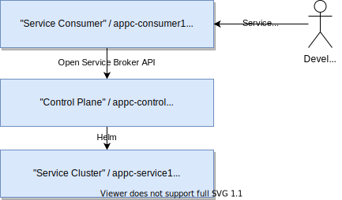
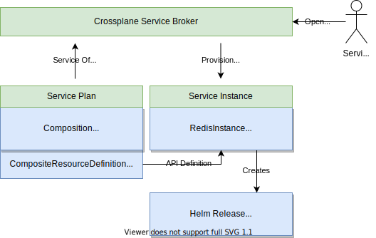

= VSHN Application Catalog Demo

This demo will provide a local demo instance of the "Application Catalog" concept of VSHN.

== Overview

The demo environment runs three Kubernetes clusters to demonstrate the separation of concerns:

Service Consumer `appc-consumer1`::
This is where the end-user deploys the applications and consumes services from the application catalog.
It runs the https://svc-cat.io/[Kubernetes Service Catalog] operator which integrates with the Crossplane Service Broker.

Control Plane `appc-control`::
Crossplane and the Crossplane Service Broker is running on this cluster.
It orchestrates the service provisioning on the service clusters.

Service Cluster `appc-service1`::
The actual service instances are provisioned on this cluster via Helm.
This is taken care of by the https://github.com/crossplane-contrib/provider-helm[Crossplane Helm Provider].
No other service is provisioned on this cluster.
There can be many service clusters, not just one like in this example.

For a detailed write-up, have a look at https://kb.vshn.ch/app-catalog/explanations/crossplane_service_broker.html[Crossplane Service Broker].

.Interaction between Crossplane Service Broker and Kubernetes objects

== Setup Crossplane

.Prerequisites
TIP: https://k3d.io/[k3d], https://helm.sh/docs/intro/install/[helm]

. Create three local Kubernetes clusters:
+
[source,shell]
----
# linux
export DOCKER_NETWORK_GATEWAY=$(docker network inspect bridge | jq -r '.[0].IPAM.Config[0].Gateway')
# macos with docker for desktop
# interface has to be adjusted
export DOCKER_NETWORK_GATEWAY=$(ipconfig getifaddr en6)

k3d cluster create appc-control -p "30000-30002:30000-30002@server:0"
k3d cluster create appc-service1 --api-port 0.0.0.0:42042 -p "30003-30010:30003-30010@server:0" --k3s-arg "--tls-san=${DOCKER_NETWORK_GATEWAY}@server:0"
k3d cluster create appc-consumer1
----

. https://crossplane.io/docs/v1.1/getting-started/install-configure.html[Install Crossplane] and https://github.com/mittwald/kubernetes-secret-generator[Secrets Generator] on `appc-control`:
+
[source,shell]
----
kubectl config use-context k3d-appc-control

helm repo add crossplane https://charts.crossplane.io/stable
helm repo add secret-generator https://helm.mittwald.de

helm install crossplane --create-namespace --namespace crossplane-system crossplane/crossplane --set "args[0]='--debug'"
helm install secret-generator --create-namespace --namespace secret-generator secret-generator/kubernetes-secret-generator
----

TIP: For OpenShift you can use the provided `crossplane-openshift-values.yaml` Helm values file for Crossplane to be compatible with the permissions.

== Configure Crossplane and App Catalog

. Create kubeconfig secret to access `appc-service1` from `appc-control`
+
[source,shell]
----
kubectl -n crossplane-system create secret generic appc-service1-kubeconfig --from-literal=kubeconfig="$(k3d kubeconfig get appc-service1 | sed -e 's|server:\s*.*$|server: https://'${DOCKER_NETWORK_GATEWAY}':42042|g')"
----

. Install and configure providers (Helm and SQL) and Secrets Generator Operator:
+
[source,shell]
----
kubectl apply -f 01-base/provider.yaml
while ! $(kubectl get ProviderConfig >/dev/null 2>&1); do echo "provider not ready yet - waiting"; sleep 1; done
kubectl apply -f 01-base/providerconfig.yaml
----

. Install Compositions (aka Plans)
+
[source,shell]
----
kubectl apply -f 02-app-catalog/app-catalog.yaml
kubectl apply -f 02-app-catalog/redis.yaml
# TODO kubectl apply -f 02-app-catalog/mariadb.yaml
----

== Instantiate a Service

. Instantiate your first service:
+
[source,shell]
----
kubectl apply -f 03-instances/redis1.yaml
# TODO kubectl apply -f 03-instances/mariadb1.yaml
----

. And now see what happens:
+
[source,shell]
----
kubectl get release
# wait until READY = true
kubectl get redisinstances.syn.tools -w
kubectl config use-context k3d-appc-service1
kubectl -n redis1 get pods
----

. Cleanup:
+
[source,shell]
----
kubectl config use-context k3d-appc-control
kubectl delete -f 03-instances/redis1.yaml
----

== Setup Crossplane Service Broker

We'll install and configure the https://github.com/vshn/crossplane-service-broker-poc[Crossplane Service Provider PoC]:

[source,shell]
----
kubectl config use-context k3d-appc-control
kubectl apply -f 04-service-broker/deployment.yaml
----

== Test Crossplane Service Broker

We'll use the Open Service Broker API via `curl` to not rely on any external utility.
With these few steps a new instance is provisioned, a binding made and finally the instance deprovisioned again.

. Prepare environment
+
[source,shell]
----
export SB_BROKER_USERNAME=osbuser
export SB_BROKER_PASSWORD=Passw0rd
export SB_BROKER_URL=http://localhost:30001
export SB_INSTANCE_NAME=mysvcinstance1
----

. Provision a service instance
+
[source,shell]
----
curl -i -s -X PUT -H "X-Broker-API-Version: 2.16" -H "Content-Type: application/json" --user "$SB_BROKER_USERNAME:$SB_BROKER_PASSWORD" "${SB_BROKER_URL}/v2/service_instances/${SB_INSTANCE_NAME}?accepts_incomplete=true" -d '{"service_id": "redis-k8s", "plan_id": "redis-small"}'
----

. Wait some time, then create a binding. If the instance is still provisioning the answer is `instance is being updated and cannot be retrieved`.
+
[source,shell]
----
curl -i -s -X PUT -H "X-Broker-API-Version: 2.16" -H "Content-Type: application/json" --user "$SB_BROKER_USERNAME:$SB_BROKER_PASSWORD" "${SB_BROKER_URL}/v2/service_instances/${SB_INSTANCE_NAME}/service_bindings/binding1" --data '{"service_id": "redis-k8s", "plan_id": "redis-small"}'
----

. Cleanup by deprovisioning the instance again
+
[source,shell]
----
curl -i -s -X DELETE -H "X-Broker-API-Version: 2.16" -H "Content-Type: application/json" --user "$SB_BROKER_USERNAME:$SB_BROKER_PASSWORD" "${SB_BROKER_URL}/v2/service_instances/${SB_INSTANCE_NAME}?accepts_incomplete=true&service_id=redis-k8s&plan_id=redis-small"
----

== Setup Service Catalog

. Install the https://svc-cat.io/docs/install/[Kubernetes Service Catalog]:
+
[source,shell]
----
kubectl config use-context k3d-appc-consumer1
helm repo add service-catalog https://kubernetes-sigs.github.io/service-catalog
helm install catalog --create-namespace --namespace catalog service-catalog/catalog
----

. Get the latest https://github.com/kubernetes-sigs/service-catalog/releases[svcat] binary.

. Register the Crossplane Service Broker
+
[source,shell]
----
kubectl create secret generic broker-creds --from-literal=username=osbuser --from-literal=password=Passw0rd
svcat register redisbroker --url http://172.17.0.1:30001 --basic-secret broker-creds
svcat marketplace
----

== Use Service Catalog

. Provision an instance
+
[source,shell]
----
svcat provision myredis --plan small --class redis-k8s
----

. Check the state of the provisioning and wait until state is ready
+
[source,shell]
----
svcat get instances
----

. Create a service binding
+
[source,shell]
----
svcat bind myredis
----

. Check the state of the binding and wait until state is ready
+
[source,shell]
----
svcat get bindings
----

. A new secret is available containing the connection details for Redis
+
[source,shell]
----
kubectl describe secret myredis
----

. Cleanup by unbinding and deprovisioning (deprovisioning is blocked until unbinding is done)
+
[source,shell]
----
svcat unbind myredis
svcat deprovision myredis
----

== Cleanup

[source,shell]
----
k3d cluster delete appc-consumer1
k3d cluster delete appc-control
k3d cluster delete appc-service1
----
